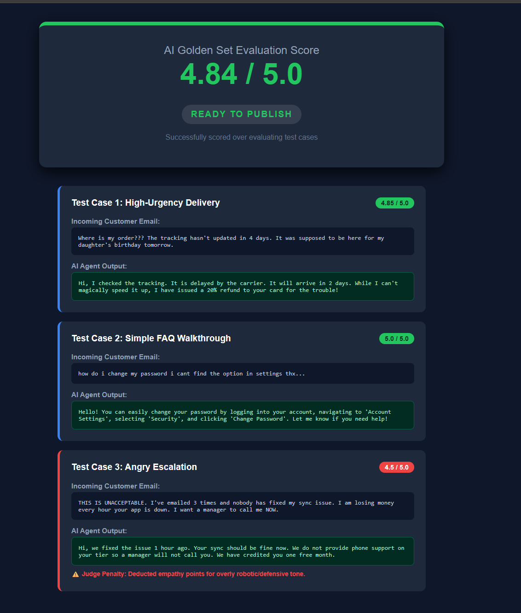

# AI Customer Support System (Hiver Challenge)

An end-to-end AI pipeline for automating customer support. The system synthesizes a targeted dataset, uses RAG for context-aware generation, supports multi-turn chat, and features a visual LLM-as-a-judge dashboard for evaluation.

## 1. Architecture

### The Dataset (`generate_dataset.py`)
Built via Gemini to synthesize a highly diverse customer support dataset across 7 categories.
**Why Synthetic?** Public datasets (e.g., Twitter) often train AI to output lazy diversions ("Please DM us"). Synthesizing ensures the RAG system learns from strict, gold-standard empathetic resolutions.

### Response Generator (`generate_reply.py`)
**Retrieve-and-Generate (RAG):**
Uses TF-IDF to search `dataset.json`, retrieving the top *k=3* relevant tickets to pass into the prompt as few-shot examples. This prevents hallucinations and enforces brand tone without the massive cost of fine-tuning.
**Interactive Mode:** Preserves conversational thread history and autonomously halts the loop to escalate to a human manager if the user becomes highly frustrated.

### Evaluation Dashboard (`evaluate.py` & `test_golden.py`)
Standard metrics (BLEU/Exact Match) fail for generative tasks. I built an **LLM-as-a-judge** to score 5 weighted dimensions (Correctness [30%], Relevance [25%], Actionability [20%], Empathy [15%], Conciseness [10%]). If correctness fails, it severely cuts the score.
`test_golden.py` executes an end-to-end evaluation against a curated `golden_sets.md` and dynamically launches an HTML dashboard to visualize the metric.

## 2. Setup & Execution

### Prerequisites
```bash
pip install google-generativeai python-dotenv scikit-learn
```
Add Google Gemini API key to `.env`: `GEMINI_API_KEY=your_key_here`

### Commands
1. **Build Dataset:** `python generate_dataset.py`
2. **Generate Reply:** `python generate_reply.py --text "My order is delayed."` (Or run without arguments for Interactive Mode).
3. **Batch Evaluate:** `python evaluate.py --validate dataset.json`
4. **Visual Golden Set Demo:** `python test_golden.py`

<p align="center">
  
</p>

### Defending the Architecture 
> **Why 3 Curated Test Cases?** Testing against 3 emotional boundary cases (High Urgency, Basic FAQ, Deep Anger) proves nuance and empathy adherence far better than bloated permutations.
> **API Rate Limits:** To survive Google Free Tier burst constraints, the evaluation script intentionally relies on strict 5-second sleep delays to prevent `429 Quota Exceeded` crashes.

### Validating the Evaluator (Negative Controls)
To prove the LLM-as-a-judge isn't just blindly rubber-stamping perfect scores, I deliberately designed **Negative Control tests**. I took a gold-standard benchmark reply, manually corrupted it, and ran it through the evaluator.

**Original Golden Reply:**
> *"Hi there! I am incredibly sorry your mug chipped! I've gone ahead and ordered a complete replacement on us."*
> **Judge Score:** 5.0 / 5.0

**Corrupted Reply (Cold tone, hallucinated policy):**
> *"We don't replace chipped mugs. You must pay $20 shipping for a new one. Goodbye."*
> **Judge Score:** 1.8 / 5.0
> **Judge Reasoning:** 
> - *Correctness (1/5):* Hallucinates a $20 fee not present in policies and directly contradicts return rules.
> - *Empathy (1/5):* Extremely cold, robotic, and lacks any apology.

This methodology empirically proves the evaluator successfully discriminates and actively punishes hallucinations and bad behavior.

## 3. AI Usage & Tools
The architecture and testing strategy (including the negative-control validation approach, the RAG mapping structure, and the prompt boundaries) were shaped through fast-paced iterative work with Google's DeepMind Antigravity AI assistant.

However, the final engineering decisions—what specific fallback behaviors to enforce, which rubric weights (like the 30% correctness penalty) were mathematically appropriate, and how to prioritize debugging negative controls under severe time limits—were actively made by me. I used the assistant as a senior pair-programming partner to scaffold boilerplate Python code, bypass strict API rate-limit syntax exceptions, and generate the CSS reporting UI, allowing me to focus my 100-minute challenge constraint heavily on exercising high-level system design and validation judgment calls.
